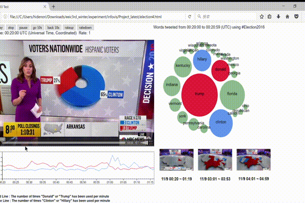

# infovis

## Description
* 2017年アメリカ大統領選挙の開票速報ライブ中継を，同時刻にTwitter上でつぶやかれた単語のトレンドとともに視聴できるシステム
* 選挙の趨勢とつぶやきのトレンドが対応づけて一目で見られる
  
  * ex) ある州の結果が出た直後にその州名が一斉につぶやかれる，両候補者の名前がつぶやかれた数から選挙の趨勢が予想できる，など

## Demo

